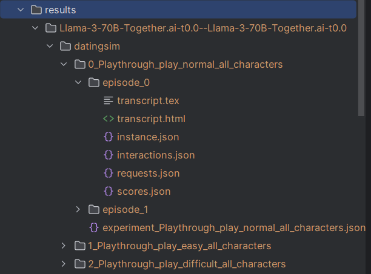
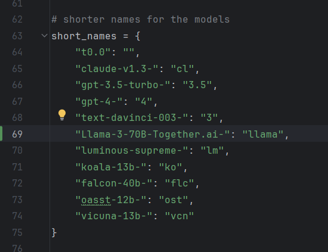

<h1> How to make plots work for less than all games</h1>

<h3>1. Preparation</h3>
Before anything else, make sure that you have instances generated for all games you want to plot.
I'm highlighting it because for testing plotting it's good to use a small number of instances (e.g. 2).

**WARNING**: if the script doesn't want to execute, make sure you use correct python version (use either 'python3' or 'python' in the script).

Once you run the game/s look at the 'results' folder.

**If you have more than 1 model or more than 1 game, clem will FORCE YOU to include it in the plot.**

For example:

In this case both datingsim and taboo must be plotted.

To run the games use the following command:
```
python3 scripts/cli.py run -g datingsim -m  Llama-3-70B-Together.ai Llama-3-70B-Together.ai -l 300
```

After running the game make sure all folders of episodes for all games have files *instance.json* and that it is not empty.
Make sure that every experiment folder contains the *experiment_name_of_experiment.json* and that it is not empty.

<h3>2. Transcribing and Scoring</h3>
After preparation, the next steps are easier.
To transcribe the game records use the command below (for a specific game):

```
python3 scripts/cli.py transcribe -g datingsim
```

or for all games:

```
python3 scripts/cli.py transcribe
```

Again make sure you transcribe all games that you have results of.

Make sure that after running the command, every episode folder contains 4 additional files:
- *interactions.json*
- *requests.json*
- *transcript.html*
- *transcript.tex*

And of course check if they are not empty.

Finally, to score the transcribed records (for a specific game):

```
python3 scripts/cli.py score -g datingsim
```

or for all games:

```
python3 scripts/cli.py score
```

After running this script, make sure that every episode folder contains *scores.json* file and that it is not empty.

This is how the structure of your files should look like right now:



<h3>3. Evaluation Part 1</h3>

Here it gets messy again, so let's go step by step.

First, go into *evaluation/evalutils.py*. There you have to make adjustments in 4 places.

0. **Line 116/117** (ONLY FOR WINDOWS USERS) 

Because clembench is not adjusted for all users, you need to make sure to change the line for correct parsing as follows:

```
splits = str(name).split('\\')
```


Change the 
1. **Line 63**

Here in short names of the models you have to add your model if it is not there.
In our case it is:
```
"Llama-3-70B-Together.ai-": "llama"
```
I added it in position 6 on the list, it can be added elsewhere but make sure to keep the order in ALL CHANGES.




2. **Line 52**

Here once you set up the short name in the previous step, you add this to the ROW_ORDER list.
In our case it is:
```
'llama--llama'
```

Again, it's position 6 on the list.


3. **Line 56**

We choose the games which we want to include in the plots.

!!! IMPORTANT !!! 
The first position on the list ('all') must not be removed.

In our case it is:
```
'datingsim'
```


In my example I am also scoring taboo for comparison.

<h3>3. Evaluation Part 2</h3>

Now that you are finished with adjusting *evalutils.py*, we move to another file in the same folder (evaluation/) called *plotting.py*.

Here we only need one change, in **line 53** change the code to this:
```
ncol=n_models
```


<h3> Finish </h3>

If you have survived all the previous steps, now feel free to run the final evaluation script:

```
python3 evaluation/papereval.py
```

This command will create many plots for all the games you have prepared and added before.

If you have ANY questions or something doesn't work, just ping the creator of this file (Jerycho).
<h3> Future Work </h3>

I will do my best to make bencheval.py work too, but I need a bit more time.